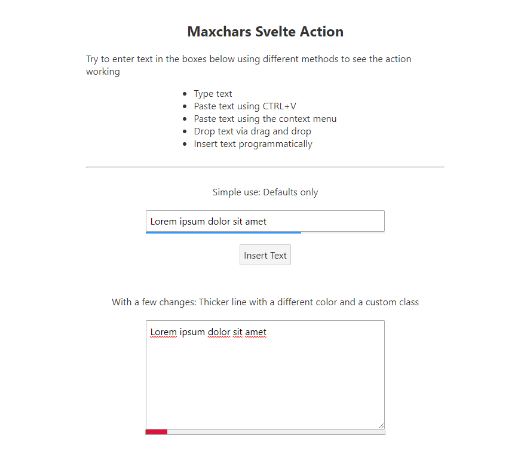

# Svelte MaxChars Action

This action creates a progress bar below your textboxes or textareas to sinalize the remaining space. It has a few settings to customize the bar and its behaviour.



```html
<script>
    import { maxchars } from './maxchars.js';

    let options = {
        length: 80,
        class: 'txtvisual',
        height: 4,
        color: 'crimson'
    }
</script>

<div>
    <input type="text" use:maxchars={options} />
</div>

<style>
    :global(.txtvisual) {
        border: 1px solid #eee;
    }
</style>
```

## Instalation

**Only tested on Svelte 3**

This is so simple that it doesn't need a NPM package. Just copy the file ``/src/maxchars.js`` to your project's appropriate folder and import it where needed. All other files are just there for the sake of the example.


## Configuration

The action can be passed an onject with configuration parameters. If it is not passed, defaults are assumed.

| Parameter | Description | Default value |
|-----------|-------------|---------------|
| bkg | Background color of the bar's track | System color 'ButtonFace' |
| color | Bar color | System color 'Highlight' |
| height | Thickness of the bar in pixels | 3 |
| class | a class name to be applied to the bar element | [EMPTY] |
| length | The maximum characters allowed in the textbox | maxlength attribute (*) |


- If no maxlength attribute exists and the length parameter is falsy, there will be no progress bar and text entry wont have any restriction.
- If no maxlength attribute exists but a length parameter is set to a number, that number is the maximum characters allowed.
- If both maxlength and length exists, length takes precedence.


## Example

Download this code, extract it and run:

```
npm run dev
```